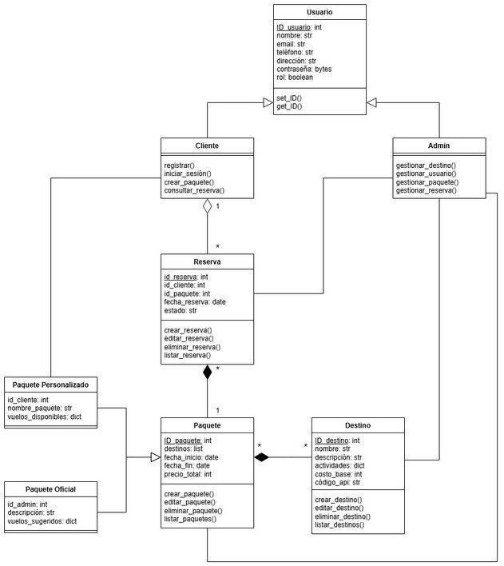

# Sistema de Gestión - Agencia de Viajes

Este fue uno de mis primeros proyectos formativos como Analista Programador. Es un sistema de escritorio desarrollado para la administración de paquetes de viaje y gestión de reservas, enfocado en afianzar mis conocimientos en interfaces gráficas y conexión a bases de datos relacionales.

## Tecnologías Utilizadas
* **Lenguaje:** Python
* **Interfaz Gráfica:** Tkinter
* **Base de Datos:** MySQL (ejecutado localmente a través de XAMPP)

## Características Principales
* Menú principal interactivo para la navegación del sistema.
* Módulo de gestión y visualización de paquetes turísticos.
* Sistema de registro de reservas.
* Conexión a base de datos MySQL para persistencia de la información.

## Estructura del Proyecto
* `main.py`: Archivo principal para ejecutar la aplicación.
* `/docs`: Diagramas de arquitectura (UML) del sistema.
* `database.sql`: Script con la estructura de las tablas de la base de datos. *(Nota: Si tienes este archivo, es ideal subirlo para que otros puedan crear la base de datos)*.

## Arquitectura del Sistema
El proyecto fue diseñado utilizando Programación Orientada a Objetos (POO). A continuación se presenta el modelo de clases que estructura la lógica de usuarios, reservas y paquetes turísticos:

## Cómo ejecutarlo localmente
1. Clona este repositorio: `git clone https://github.com/Dignasus/TU-REPOSITORIO.git`
2. Abre **XAMPP** e inicia los servicios de **Apache** y **MySQL**.
3. Importa la base de datos en tu phpMyAdmin o gestor preferido.
4. Asegúrate de tener Python instalado y ejecuta el archivo principal desde la terminal: 
   `python main.py`
